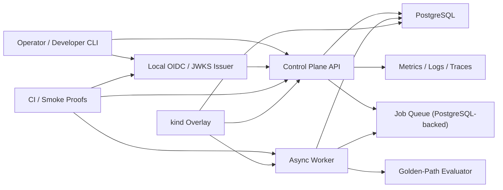
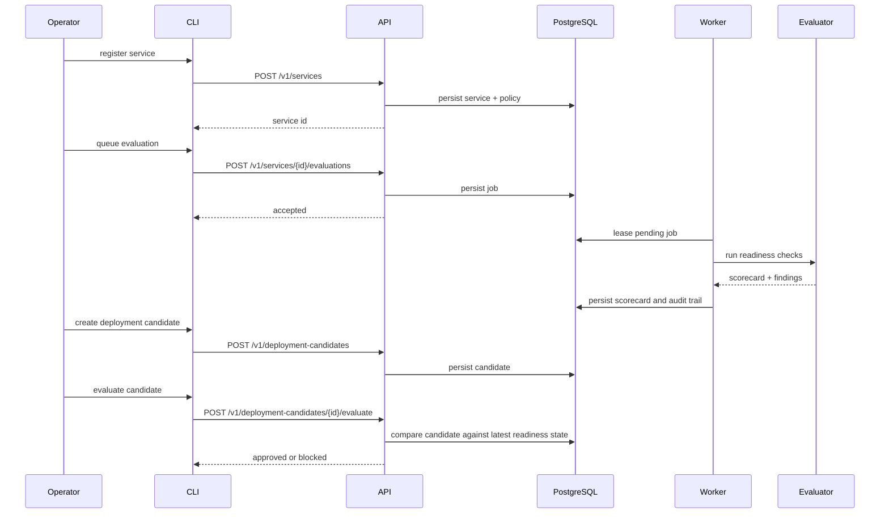

# golden-path-control-plane

`golden-path-control-plane` is a Go-based internal developer platform backend that focuses on one high-value platform workflow: onboarding services, evaluating release readiness asynchronously, and gating deployment candidates against explicit operational standards.

It is deliberately built as a strong, reviewer-grade v1 rather than a fake "platform" padded with unexercised abstractions. The repository demonstrates authenticated control-plane APIs, deterministic golden-path checks, asynchronous worker orchestration, honest local cloud-native proof paths, and verification gates that are actually run.

Current reviewed tag: [`v0.1.1`](https://github.com/JuanPabloGaviria/golden-path-control-plane/tree/v0.1.1)

## Why This Repo Exists

Internal platform work is easy to oversell and easy to fake. Many repos claim:

- internal developer platform
- Kubernetes readiness
- release engineering
- observability
- platform APIs

but stop at static manifests, partial mocks, or hand-wavy architecture.

This repository was built to show a narrower but much more defensible slice:

1. A service is registered with ownership, operational metadata, and an SLO policy.
2. The platform enqueues a readiness evaluation.
3. An asynchronous worker runs deterministic golden-path checks.
4. The latest scorecard becomes queryable through the control plane.
5. A deployment candidate is evaluated against the current readiness state and either approved or blocked.

That flow is the center of gravity of the repo.

## What This Demonstrates

- Go-based control-plane API design without microservice theater
- explicit config contracts and fail-fast runtime boot
- HMAC and OIDC/JWKS-authenticated control-plane access
- asynchronous worker-driven evaluation and deployment gating
- PostgreSQL-backed persistence and job leasing semantics
- OpenAPI-backed contract publication
- Docker Compose and `kind` proof paths instead of documentation-only deployment claims
- a verification posture that includes formatting, linting, tests, race tests, contract checks, build checks, vuln scans, config scans, and smoke flows

## System Overview



## Critical Flow



## Core Capabilities

### Service onboarding

- ownership and operational metadata capture
- runbook, health endpoint, observability URL, repository URL
- SLO policy attached at registration time

### Readiness evaluation

- deterministic golden-path rules
- asynchronous execution through a worker
- persisted scorecards and findings
- explicit state transitions instead of implicit readiness assumptions

### Deployment gating

- deployment candidate creation
- evaluation against latest readiness evidence
- approval/block decision recorded through the control plane

### Auth and access

- local HMAC proof mode
- local OIDC/JWKS proof mode
- audience/issuer validation
- role-aware token issuance through the CLI

### Operability

- fail-fast configuration
- health, readiness, and metrics endpoints
- explicit schema migration workflow
- structured error envelopes and middleware

## Repository Layout

| Path | Responsibility |
| --- | --- |
| `cmd/api` | HTTP control-plane API, health, readiness, metrics |
| `cmd/worker` | async job processor |
| `cmd/cli` | operator and developer CLI for proof flows |
| `cmd/migrate` | one-shot schema migrator |
| `cmd/devoidc` | local OIDC/JWKS issuer for proof paths |
| `internal/app` | orchestration and core use cases |
| `internal/auth` | JWT validation and token handling |
| `internal/config` | configuration contract and validation |
| `internal/domain` | domain models and invariants |
| `internal/httpx` | HTTP middleware and error envelopes |
| `internal/jobs` | worker runtime behavior |
| `internal/migrations` | embedded schema lifecycle |
| `internal/observability` | logging, tracing, metrics wiring |
| `internal/platformchecks` | deterministic readiness rules |
| `internal/postgres` | persistence, scorecards, job leasing, audit trail |
| `openapi/openapi.yaml` | published API contract |
| `deployments/docker-compose.yml` | containerized local proof path |
| `deployments/kubernetes/overlays/local-kind` | verified local Kubernetes deployment shape |
| `docs/verification-matrix.md` | claim-to-proof mapping |

## Public API Surface

### Service lifecycle

- `POST /v1/services`
- `PATCH /v1/services/{service_id}`
- `POST /v1/services/{service_id}/evaluations`
- `GET /v1/services/{service_id}/scorecard`

### Deployment lifecycle

- `POST /v1/deployment-candidates`
- `POST /v1/deployment-candidates/{candidate_id}/evaluate`
- `GET /v1/deployment-candidates/{candidate_id}`

### Audit and operability

- `GET /v1/audit-events`
- `GET /healthz`
- `GET /readyz`
- `GET /metrics`

## Local Proof Paths

### Native local runtime

```bash
set -a
source .env
set +a

go run ./cmd/migrate
go run ./cmd/api
go run ./cmd/worker
go run ./cmd/cli --help
make smoke
```

### Docker Compose proof

Runs PostgreSQL, API, worker, migrator, and local OIDC in containers:

```bash
make smoke-compose
```

### Kubernetes proof

Exercises the verified `kind` overlay with local images and real rollout checks:

```bash
make smoke-kind
```

Kubernetes assets are documented in [deployments/kubernetes/README.md](./deployments/kubernetes/README.md). Only the `overlays/local-kind` deployment shape is claimed as verified.

## Verification and Quality Gates

This repository intentionally keeps claims tied to concrete proof. The full claim-to-proof table lives in [docs/verification-matrix.md](./docs/verification-matrix.md).

Primary gates:

- `make tools`
- `make fmt`
- `make check-fmt`
- `make lint`
- `make test`
- `make integration INTEGRATION_DATABASE_URL=...`
- `make race`
- `make ci`
- `make contract`
- `make build`
- `make render-k8s`
- `make vuln`
- `make scan-config`
- `make scan-image`

## Config Model

The environment contract lives in [`.env.example`](./.env.example).

Key properties:

- `.env.example` is documentation, not a committed runtime secret source
- invalid or placeholder configuration fails boot
- production mode rejects unsafe HMAC auth
- secrets are redacted from diagnostics

Example local shell export:

```bash
set -a
source .env
set +a
```

## Design Principles

- narrow, defensible scope over fake platform breadth
- deterministic checks over opaque scoring magic
- fail fast on invalid configuration
- explicit schema lifecycle over implicit boot-time migration side effects
- honest boundaries over "production-ready" theater
- proof-backed claims over aspirational documentation

## Truthfulness Boundaries

This repo does **not** claim:

- managed cloud deployment proof
- managed Postgres operations, backup, or disaster recovery
- external enterprise identity provider integration
- full production SLO dashboards and paging operations
- generalized service mesh or multi-cluster platform behavior

It does claim:

- strong local runtime proof
- Compose-backed proof
- `kind`-backed Kubernetes proof
- authenticated control-plane API flows
- deterministic readiness evaluation and deployment gating

## Why It Matters

The point of this repository is not to imitate a hyperscale platform. The point is to show platform engineering judgment in code:

- choosing a high-leverage slice
- enforcing explicit standards
- designing APIs and workers that support operational correctness
- proving the runtime path instead of merely diagramming it
- and documenting only what is actually exercised

If you want a repo that demonstrates Go, distributed-system thinking, control-plane design, asynchronous orchestration, cloud-native proof paths, and reviewer-grade engineering discipline, that is what this repository is meant to do.
