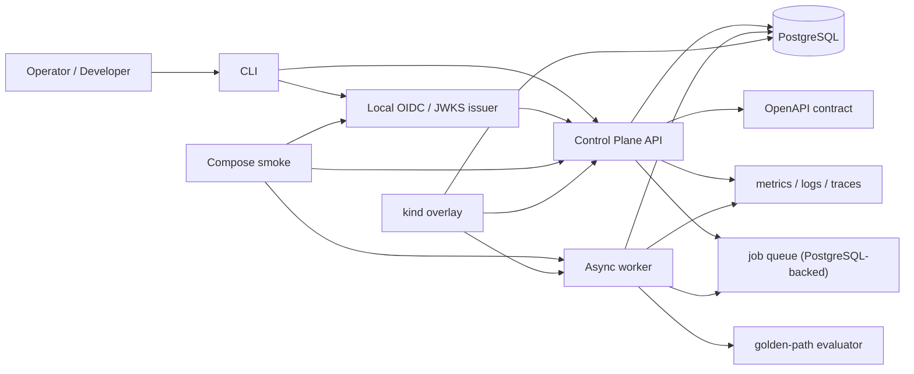
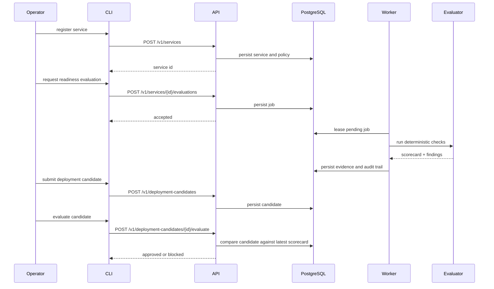

# golden-path-control-plane

Control plane for service onboarding, readiness evaluation, and deployment gating, built to show what platform engineering looks like when the runtime has to survive review instead of merely rendering architecture diagrams.

Current reviewed tag: [`v0.1.1`](https://github.com/JuanPabloGaviria/golden-path-control-plane/tree/v0.1.1)

## Abstract

`golden-path-control-plane` focuses on a narrow but defensible platform workflow:

1. a service is registered with ownership and operational metadata
2. readiness evidence is requested explicitly
3. an asynchronous worker executes deterministic platform checks
4. the latest scorecard becomes durable control-plane state
5. a deployment candidate is evaluated against that state and either approved or blocked

That scope is smaller than many "platform" repositories. It is also stronger. The repo avoids pretending that a pile of YAML, a dashboard screenshot, or a static scoring rubric is the same thing as a working control plane.

## System Thesis

The thesis behind this repository is simple:

> release readiness is not a spreadsheet problem. It is a control-plane problem with contracts, state transitions, authenticated actions, and durable evidence.

Everything in the repository serves that claim: authenticated APIs, worker leasing semantics, published contracts, explicit migration flow, reproducible local proof paths, and platform checks that run deterministically.

## At A Glance

| Dimension | Current position |
| --- | --- |
| Primary workload | Service registration, readiness evaluation, deployment candidate gating |
| Implementation language | Go |
| Persistence | PostgreSQL for control-plane state, jobs, scorecards, and audit trail |
| Auth posture | HMAC proof mode plus OIDC/JWKS validation |
| Proof surface | direct local runtime, Docker Compose, and verified `kind` overlay |
| Verification posture | format, lint, tests, race, contract, build, vulnerability, config, image, and smoke gates |

## Runtime Topology



## Critical Flow



## What Is Actually Real

- The API, worker, migrator, CLI, and local OIDC issuer all build and run as first-class binaries.
- Readiness evaluation is asynchronous and durable; it is not simulated inside an HTTP handler.
- Deployment gating reads persisted readiness state instead of recomputing implied readiness on demand.
- The Kubernetes claim is limited to the `kind` overlay that the repo actually exercises.
- OIDC is a local proof asset, not a production identity claim.

## Control-Plane Invariants

### State and lifecycle

- service registration is explicit
- evaluation requests are persisted
- workers lease pending jobs instead of free-running on assumptions
- deployment approval is derived from the latest stored readiness evidence

### Operational behavior

- invalid configuration fails boot
- schema lifecycle is explicit and checked before runtime starts
- errors are structured and traceable
- jobs and scorecards are durable control-plane facts

### Truthfulness boundaries

- no managed cloud platform is claimed as verified
- no external enterprise identity provider is claimed as integrated
- no production SLO dashboarding story is claimed beyond the local proof surface

## Public Surface

### Service lifecycle

- `POST /v1/services`
- `PATCH /v1/services/{service_id}`
- `POST /v1/services/{service_id}/evaluations`
- `GET /v1/services/{service_id}/scorecard`

### Deployment lifecycle

- `POST /v1/deployment-candidates`
- `POST /v1/deployment-candidates/{candidate_id}/evaluate`
- `GET /v1/deployment-candidates/{candidate_id}`

### Audit and operability

- `GET /v1/audit-events`
- `GET /healthz`
- `GET /readyz`
- `GET /metrics`

## Proof Surface

| Claim | Proof |
| --- | --- |
| The binaries and contracts build cleanly | `go build ./cmd/api ./cmd/worker ./cmd/cli ./cmd/migrate ./cmd/devoidc` |
| Runtime config rejects unsafe or invalid settings | `go test ./internal/config` |
| Auth validation rejects bad issuer, audience, expiry, and role | `go test ./internal/auth ./internal/api` |
| Database bootstrap is explicit and enforced | `go test -tags=integration ./internal/migrations ./internal/app` |
| Local direct runtime flow is real | `make smoke` |
| Compose runtime is real | `make smoke-compose` |
| Kubernetes assets are exercised, not decorative | `make smoke-kind` |

The full claim-to-proof table lives in [docs/verification-matrix.md](docs/verification-matrix.md).

## Repository Guide

- [Verification matrix](docs/verification-matrix.md)
- [Kubernetes proof surface](deployments/kubernetes/README.md)
- `openapi/openapi.yaml`
- `deployments/docker-compose.yml`
- `deployments/kubernetes/overlays/local-kind`

## Review Path

```bash
make ci
make smoke-compose
make smoke-kind
```

For contract and platform-asset checks:

```bash
make contract
make render-k8s
make vuln
make scan-config
make scan-image
```

## Configuration Model

The environment contract is published in [`.env.example`](.env.example).

Key rules:

- `.env.example` documents the contract; it is not a secret source
- invalid or placeholder configuration fails boot
- production mode rejects unsafe local HMAC shortcuts
- diagnostics redact sensitive fields

## Non-Claims

- This repository does not claim a production IDP integration.
- It does not claim managed-cloud rollout proof.
- It does not claim that static manifests alone make a platform real.
- It does claim a reviewer-grade local control plane with authenticated APIs, durable readiness evidence, and reproducible runtime proof paths.
